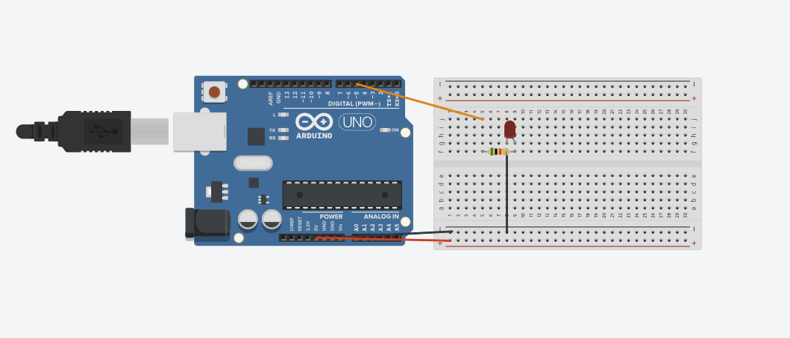

# arduino_led_project

LED dimming in and out

This project demonstrates the fundamentals of micro-controller output manipulation using Pulse-Width Modulation (PWM) on an Arduino board. Instead of simply turning an LED fully HIGH (on) or LOW (off), this system uses the analogWrite() function to vary the average voltage delivered to the LED. This creates a smooth, continuous "breathing" or fading effect, simulating an analog voltage change using digital hardware.

## CLEAN DIAGRAM

## HARDWARE
- ARDUINO UNO 3
- RED LED
- 5K Resistor
